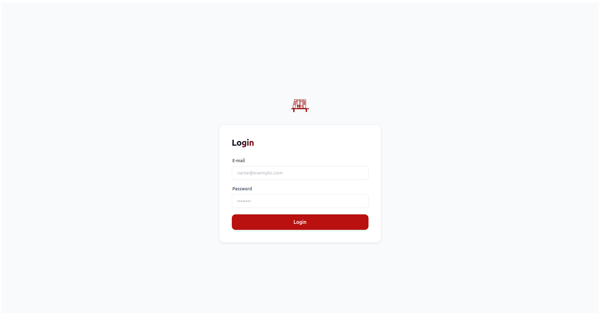
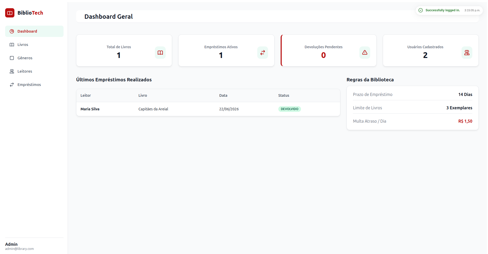
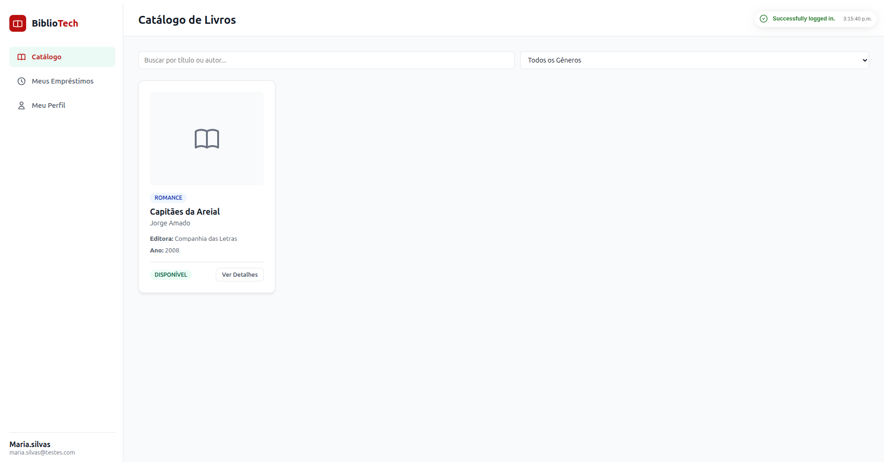
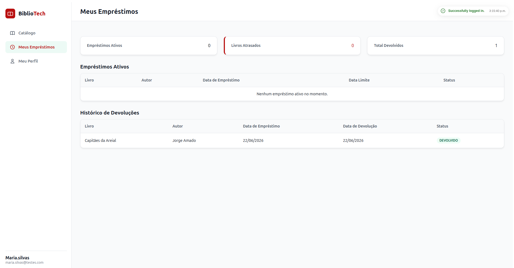

<div align="center">
  <h1>📚 LibraryManager (Web Frontend)</h1>
  <p><strong>Sistema de Gerenciamento de Bibliotecas moderno, rápido e altamente responsivo.</strong></p>

  <p>
    
    
    
    
  </p>
</div>

<br>

O **LibraryManager** é a interface web de um robusto sistema para gerenciamento de acervos bibliotecários. A aplicação foi construída utilizando o estado da arte do ecossistema **Angular**, tirando proveito das mais recentes diretrizes arquiteturais (Standalone Components, Signals, rxResource e Functional Interceptors), com uma interface gráfica limpa estilizada do zero (sem frameworks de UI externos) utilizando SCSS e a metodologia **BEM (Block, Element, Modifier)**.

---

## 📸 Telas do Sistema

> *Adicione aqui as imagens/screenshots reais do sistema substituindo as tags abaixo.*

<div align="center">
  <!-- Exemplo de como colocar as imagens:  -->
  
  
</div>

<div align="center">
  
  
</div>

---

## 🚀 Principais Funcionalidades

O sistema é dividido por **RBAC (Role-Based Access Control)** em dois grandes módulos:

### 🛡️ Módulo do Administrador (Bibliotecário)
- **Dashboard Estatístico:** Painel gerencial com kpis em tempo real (Total de empréstimos, livros disponíveis, e usuários ativos).
- **Gestão do Acervo:** CRUD completo de Livros e Gêneros literários.
- **Painel de Empréstimos:** Acompanhamento de todas as retiradas, renovações, devoluções e identificação fácil de empréstimos atrasados (`Overdue`).
- **Controle de Usuários:** Listagem de leitores cadastrados com feedback visual de permissões através de badges interativos.

### 📖 Módulo do Leitor
- **Catálogo Interativo:** Grade de livros estilizada com busca rápida (por título, autor ou ISBN) utilizando *debounce* para não sobrecarregar a API.
- **Controle de Leitura (Meus Empréstimos):** Tabela exclusiva para o leitor verificar seus livros em posse e as datas limite para devolução.
- **Histórico Completo:** Registro de todos os livros devolvidos e seus status finais.
- **Meu Perfil:** Consulta e edição dos dados cadastrais pessoais (senha, email, nome).

---

## 🛠️ Arquitetura e Decisões Técnicas

O código foi minuciosamente pensado para promover reutilização, previsibilidade e eliminar *boilerplate*.

### 1. Reatividade e Gerenciamento de Estado (Signals)
O projeto abandonou abordagens antigas baseadas massivamente em `RxJS`/`BehaviorSubjects` para renderização, em favor de **Angular Signals (`signal`, `computed`, `effect`)**. Para o consumo de APIs REST, foi empregada a API nativa experimental **`rxResource`**, que simplifica estados de carregamento e gerencia parâmetros reativos diretamente na View.

### 2. Rotas, Guards e Resolvers Funcionais
- **Resolvers:** Utilizamos Resolvers Funcionais (`ResolveFn`) para buscar dados antes do carregamento da rota (ex: `userProfileResolver`).
- **withComponentInputBinding:** Os componentes recebem os dados do Resolver ou parâmetros da URL diretamente como propriedades `@Input()` ou `input()`, isolando o componente do `ActivatedRoute`.
- **Guards:** Proteção de rotas baseadas na role do JWT salvo via HTTP-Only no Cookie.

### 3. Diretivas, Pipes e Utilities Customizados
- **Diretivas (`[appRoleBadge]`):** Encapsulamento de comportamento e estilo de manipulação do DOM. A diretiva detecta a Role e injeta classes CSS apropriadas de Badge automaticamente.
- **Pipes (`loanStatusLabel`, `loanStatusBadge`):** Transformação visual das propriedades dos modelos, mantendo os templates limpos.
- **Signal Utilities (`debouncedSignal`):** Helper genérico customizado para combinar `toObservable`, `debounceTime(400ms)` e `toSignal` de forma limpa, utilizado nos inputs de busca para poupar requisições sucessivas ao banco.

### 4. Metodologia BEM + SCSS
Em vez de depender de Bootstrap ou Tailwind, o projeto gerencia seu próprio *Design System*.
- Uso de `variables.scss` (`$color-primary`, `$font-size-sm`).
- Estrutura **Block, Element, Modifier** (`.c-card`, `.c-card__title`, `.c-btn--primary`).
- Arquivos modulares isolando layout (`.l-app`), componentes (`.c-`) e utilitários (`.u-`).

---

## 📂 Estrutura de Pastas

A organização segue a separação por Features em vez de tipo de arquivo:

```text
src/app/
 ├── core/                  # Singleton services, interceptors, guards e resolvers globais
 │   ├── auth/              # Lógica de login, tokens e roles
 │   ├── interceptors/      # Injeção de headers e tratamento global de erros HTTP
 │   └── resolvers/         # Buscas na API acionadas pré-navegação
 │
 ├── features/              # Módulos de negócio da aplicação (Roteados)
 │   ├── admin/             # Rotas filhas do administrador (livros, usuários, dashboard)
 │   ├── user/              # Rotas filhas do leitor (catálogo, empréstimos, perfil)
 │   └── not-found/         # Página 404 personalizada
 │
 ├── layout/                # Estruturas de wrapper de página (Sidebars, Menus base)
 │
 ├── shared/                # Peças reutilizáveis sem domínio de negócio estrito
 │   ├── components/        # Modais, Loading spinners, Cards base
 │   ├── directives/        # Diretivas (ex: appRoleBadge)
 │   ├── enums/             # Enumerações compartilhadas (ex: LoanStatus)
 │   ├── models/            # Interfaces de tipagem do TypeScript (.interface.ts)
 │   ├── pipes/             # Transformadores de strings (ex: data, status)
 │   ├── services/          # Serviços genéricos (Users, Books, Loans)
 │   ├── styles/            # Core do SCSS (mixins, variáveis, classes globais)
 │   └── utils/             # Helpers e Factories (signal.utils.ts)
```

---

## 💻 Como Rodar Localmente

### Pré-requisitos
- **Node.js** (v18+)
- **Angular CLI** instalado globalmente (`npm install -g @angular/cli`)

### Instalação e Execução
1. Clone este repositório:
   ```bash
   git clone https://github.com/suelenmedinape/LibraryManager.Web.git
   ```
2. Instale as dependências:
   ```bash
   cd LibraryManager.Web
   npm install
   ```
3. Inicie a aplicação web:
   ```bash
   ng serve
   ```
4. Acesse em `http://localhost:4200/`.

> **⚠️ Atenção:** O Frontend espera se conectar à API em `http://localhost:8080/v1` (configurado em `src/environments/environment.ts`). Você não conseguirá logar sem que o backend esteja ativo na sua máquina.

### Executando os Testes Unitários
A suíte de testes utiliza o **Vitest** devido a sua execução quase instantânea em relação ao Karma/Jasmine clássicos.
```bash
ng test
```

---

## 🙏 Agradecimentos e Créditos do Backend

Todo o funcionamento autêntico, validações, persistência em banco de dados SQL e segurança JWT desta interface gráfica são processados e fornecidos por uma robusta e incrível **API Backend (Java/Spring)**. 

Os **créditos integrais** da construção do motor (Backend) deste gerenciador de bibliotecas vão para [Aline](https://github.com/alineaos):

🔗 **Repositório do Servidor/Backend:** [https://github.com/alineaos/gerenciador-de-bibliotecas](https://github.com/alineaos/gerenciador-de-bibliotecas)

Recomendo fortemente que você confira, dê uma estrela (⭐️) no repositório dela e siga as instruções para inicializar o ambiente backend (incluindo o banco de dados) antes de tentar acessar este projeto Frontend!

---

<div align="center">
  Construído com extrema atenção aos detalhes e boas práticas.
</div>
